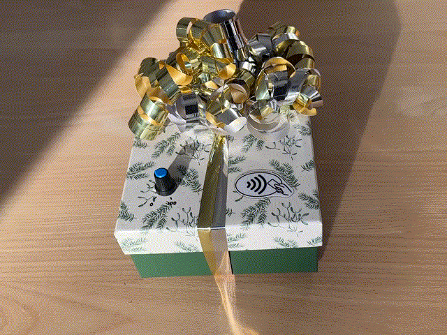
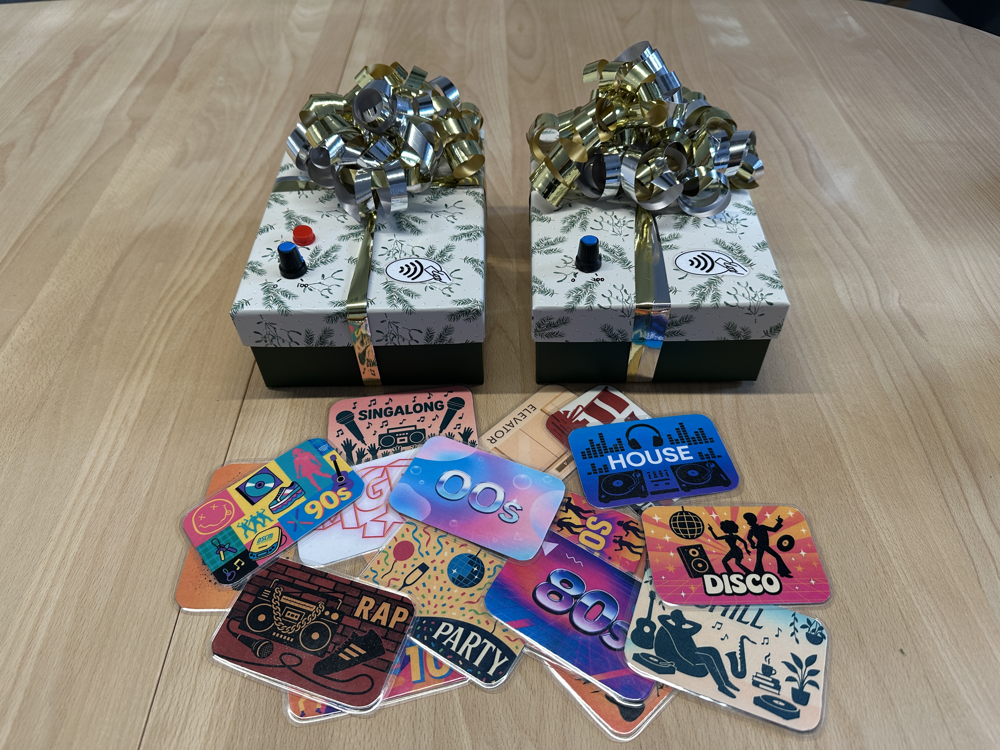

# NFC Party Controller

> Tap a card. Play a playlist. Control your home.

A battery-powered, event-driven home automation system using custom ESP32 hardware and NFC cards to control Spotify playback and Philips Hue lighting. Built with ESPHome and Home Assistant, this project showcases IoT system integration, hardware-software interfacing, and smart home architecture.

---

## What It Does

**Physical NFC cards** trigger Spotify playlists, lighting scenes, and system controls through two battery-powered ESP32 devices strategically placed in my home.

- **Music Control**: Scan a card to start a playlist, rotate the potentiometer to adjust volume, press the pause button (Device 2)
- **Lighting Automation**: NFC cards trigger Philips Hue lighting scenes coordinated with music playback
- **Admin Functions**: Dedicated NFC cards reset playback queue, toggle permissions, restart system, or control smart plugs
- **Battery-Powered**: Each device runs 40-60 hours on 18650 lithium-ion cells with WiFi power-saving optimizations
- **Event-Driven**: NFC tag IDs aren't hardcoded in firmware—all logic lives in Home Assistant for easy reconfiguration
- **Dual Devices**: Device 1 (living room) with volume control, Device 2 (kitchen) adds a physical pause button

## Demo



*Tapping an NFC card to queue a song favourite*

<p align="center">
  
</p>

*Device 1 (living room) and Device 2 (kitchen) with custom NFC cards*

---

## Why NFC Cards?

Traditional party music control creates friction—guests compete for phone access to change songs, hosts become tethered to DJ duties, and music selection becomes a point of conflict rather than connection. This project was born from both a practical need and creative curiosity: could physical objects (NFC cards) transform music control from a utilitarian task into a social experience that sparks conversation and interaction?

Beyond solving the technical problem, the project allowed exploration of the creative design space where hardware meets user experience—designing card aesthetics, crafting intuitive interactions, and building a system that encourages rather than inhibits social dynamics. It served as a comprehensive technical challenge integrating multiple complex systems (microcontrollers, home automation, APIs, networked audio) while testing whether thoughtful interface design could make technology feel more human and playful in a real-world party environment.

---

## Technical Highlights

### Hardware Design

**Custom ESP32 Controller** built from scratch with hand-soldered components on protoboard:
- **PN532 NFC Reader**: I2C communication (GPIO 21/22) for reading NTAG215 cards
- **10kΩ Potentiometer**: ADC input (GPIO 34) with 12dB attenuation for volume control
- **2N7000 MOSFET Circuit**: Level-shifted buzzer driver with 1kΩ gate resistor and 1N5818 flyback diode for driving 5V passive buzzer from 3.3V GPIO
- **Pause Button**: GPIO 18 pullup input (Device 2 only)
- **Battery System**: 18650 lithium-ion cells (2x for Device 1, 1x for Device 2) with charging circuit

**Power Optimization Challenges**:
- Configured for extended battery life: ESPHome WiFi light sleep mode and PN532 duty cycle optimization
- PN532 scan interval: 1s with 100-200ms active scanning (10-20% duty cycle)
- Target power draw: 100-150mA per device for 40-60 hour operation on 18650 cells

### Firmware Architecture

**ESPHome Configuration**:
- **Modular Package System**: `common.yaml` contains shared configuration, device-specific files extend it
- **ADC Filtering**: Sliding window moving average + delta filter eliminates potentiometer noise
- **75% Volume Clamp**: Prevents guests from setting excessive volume levels
- **RTTTL Buzzer Feedback**: PWM-driven audio feedback on NFC scan events

### Software Design

**Event-Driven Architecture**:
- ESP32 devices emit NFC tag events to Home Assistant (no business logic in firmware)
- All playlist assignments, lighting triggers, and automation logic in Home Assistant
- Tags can be reassigned without reflashing firmware

**Home Assistant Integration**:
- **Spotcast**: Handles Spotify playback initiation and speaker targeting
- **SpotifyPlus**: Provides Spotify API access for advanced controls
- **Philips Hue**: Synchronized lighting scenes triggered by NFC cards
- **Automations/Scripts/Blueprints**: Modular YAML configuration organized by function

---

## System Architecture

```
NFC Cards → PN532 Readers → ESP32 Devices (ESPHome)
                                  ↓
                         Home Assistant
                          ↓      ↓      ↓
                     Spotify  Hue  Admin Controls
```

**Design Principles**:
- **Separation of Concerns**: ESPHome handles hardware events, Home Assistant handles all business logic
- **Event-Driven**: NFC tags emit events; no hardcoded tag IDs in firmware allows flexible reassignment
- **Modular Configuration**: Automations organized by function (device controls, NFC admin, lighting, Spotify integrations)
- **Security**: API encryption, OAuth tokens, secrets in gitignored files

See detailed architecture decisions: [docs/ARCHITECTURE.md](docs/ARCHITECTURE.md)

## Related Project: Visual Dashboard

This NFC controller can be enhanced with an optional **real-time visualization dashboard**:

**[New Year Dashboard](https://github.com/Haugenau20/new-year-dashboard)** - React/TypeScript web application providing:
- Real-time Spotify playback display with album artwork and dynamic backgrounds
- Special song detection (highlights tracks triggered by NFC cards)
- Integration with Home Assistant API and Spotify Web API
- Built for New Year celebration, adaptable for general "now playing" displays

The dashboard is **purely a visual enhancement** - the NFC controller functions completely independently. Together, they demonstrate a full-stack IoT ecosystem from embedded hardware to modern web frontend.

---

## Technology Stack

**Firmware**:
- [ESPHome](https://esphome.io/) - ESP32 firmware framework with YAML configuration

**Platform**:
- [Home Assistant](https://www.home-assistant.io/) - Automation platform and integration hub

**Integrations**:
- [Spotcast](https://github.com/fondberg/spotcast) - Spotify playback control
- [SpotifyPlus](https://github.com/thlucas1/homeassistantcomponent_spotifyplus) - Spotify Web API integration
- [Philips Hue](https://www.home-assistant.io/integrations/hue/) - Smart lighting control

---

## Project Structure

```
nfc-party-controller/
├── esphome/                    # ESP32 firmware configurations
│   ├── common.yaml             # Shared device configuration
│   ├── nfc_controller_1.yaml  # Device 1
│   └── nfc_controller_2.yaml  # Device 2 (with pause button)
├── home-assistant/             # Home Assistant automations and configs
│   ├── device_controls/        # Volume and button automations
│   ├── nfc_admin/              # Admin card functions
│   ├── spotcast/               # Spotify playback scripts
│   ├── spotifyplus/            # Spotify API automations
│   └── lighting/               # Hue lighting automations
├── hardware/                   # Schematics, pinouts, assembly notes
│   ├── README.md               # Hardware documentation
│   └── schematics/             # Circuit diagrams and pinout tables
└── docs/                       # Architecture and troubleshooting
    ├── ARCHITECTURE.md         # System design and decisions
    └── TROUBLESHOOTING.md      # Common issues and solutions
```

---

## Documentation

- [System Architecture](docs/ARCHITECTURE.md) - Design principles and key technical decisions
- [Hardware Details](hardware/README.md) - Complete schematics, pinouts, and component selection rationale
- [ESPHome Configuration](esphome/README.md) - Firmware architecture and configuration details
- [Troubleshooting Guide](docs/TROUBLESHOOTING.md) - Hardware and software debugging reference

---

## License

MIT License - See [LICENSE](LICENSE) for details

---

**Developer**: Søren
**Built**: Q4 2025, Deployed: New Year's Eve 2025
